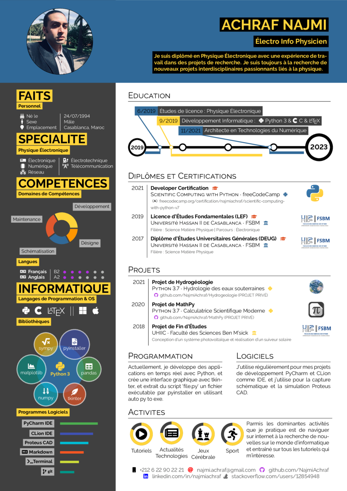
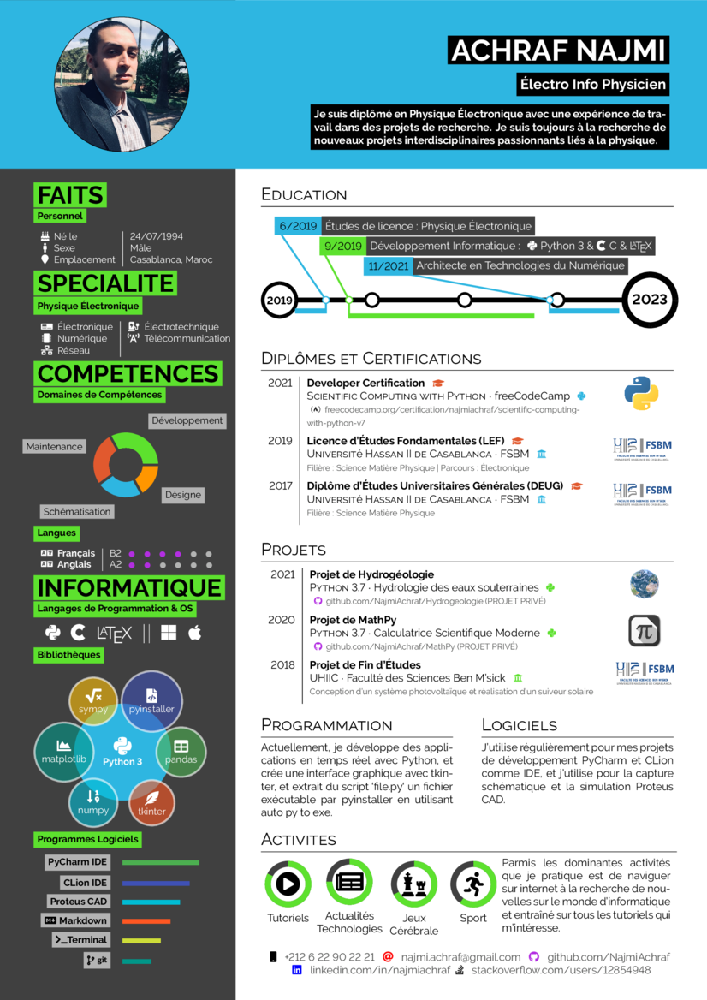
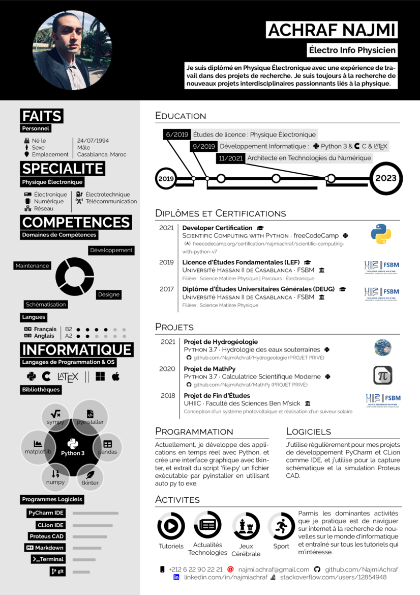
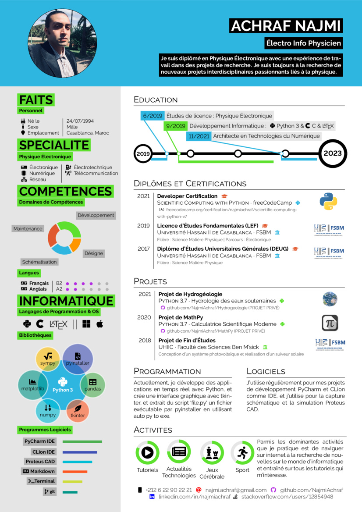
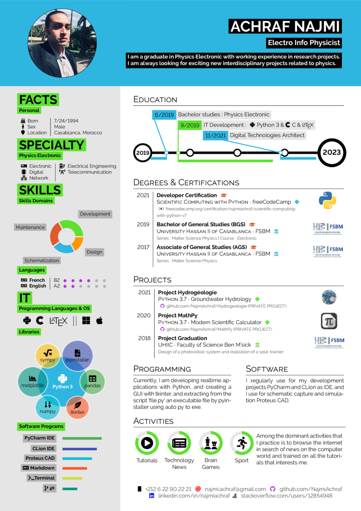
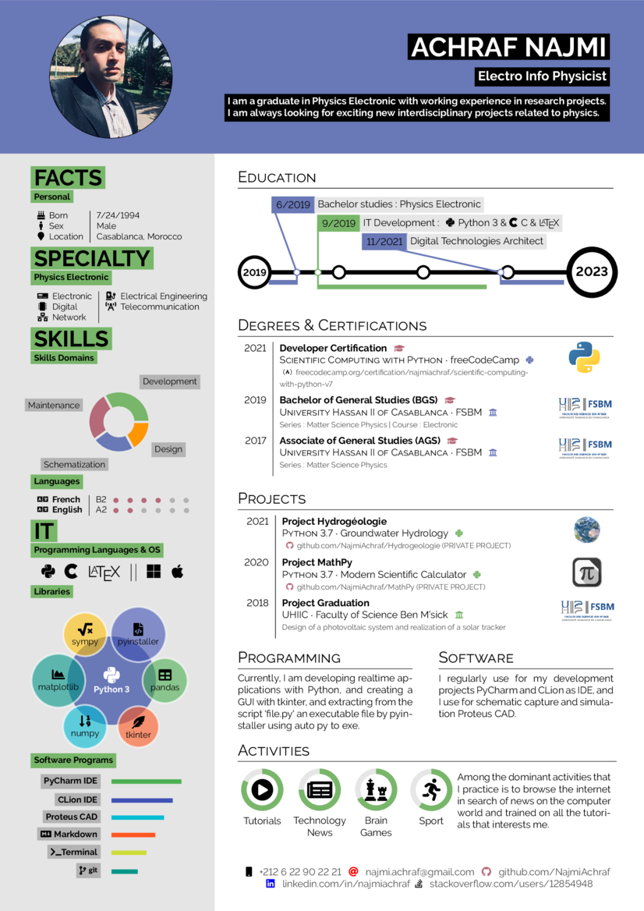

<h1 align="center">
  CV ReX it's LaTeX Resume
</h1>

<div align="center">
  <a href="http://www.repostatus.org/#active" title="Project Status: Active – The project has reached a stable, usable state and is being actively developed.">
    
  </a>
  <a href="https://gitlicense.com/license/NajmiAchraf/cvrex">
    
  </a>  
</div>


**These images are in the CV are pesonal.**
Please replace them with your own photos and logos if you use this template!

## IT Electronic French

<table width="100%" margin-left="auto" margin-right="auto">
  <tr>
    <th>IT Electronic darkpython FR</th>
    <th>IT Electronic darkxp FR</th>
    <th>IT Electronic black&white FR</th>
    <th>IT Electronic dark FR</th>
  </tr>
  <tr>
    <td width="25%">
      
    </td>
    <td width="25%">
      
    </td>
    <td width="25%">
      
    </td>
    <td width="25%">
      
    </td>
  </tr>
</table>
</div>

<table width="100%" margin-left="auto" margin-right="auto">
  <tr>
    <th>IT Electronic lighpython FR</th>
    <th>IT Electronic lightxp FR</th>
    <th>IT Electronic vista FR</th>
    <th>IT Electronic light FR</th>
  </tr>
  <tr>
    <td width="25%">
      
    </td>
    <td width="25%">
      
    </td>
    <td width="25%">
      
    </td>
    <td width="25%">
      
    </td>
  </tr>
</table>
</div>

## IT Electronic English

<table width="100%" margin-left="auto" margin-right="auto">
  <tr>
    <th>IT Electronic darkpython EN</th>
    <th>IT Electronic darkxp EN</th>
    <th>IT Electronic black&white EN</th>
    <th>IT Electronic dark EN</th>
  </tr>
  <tr>
    <td width="25%">
      
    </td>
    <td width="25%">
      
    </td>
    <td width="25%">
      
    </td>
    <td width="25%">
      
    </td>
  </tr>
</table>
</div>

<table width="100%" margin-left="auto" margin-right="auto">
  <tr>
    <th>IT Electronic lighpython EN</th>
    <th>IT Electronic lightxp EN</th>
    <th>IT Electronic vista EN</th>
    <th>IT Electronic light EN</th>
  </tr>
  <tr>
    <td width="25%">
      
    </td>
    <td width="25%">
      
    </td>
    <td width="25%">
      
    </td>
    <td width="25%">
      
    </td>
  </tr>
</table>
</div>


## Usage

This is how to invoke the different color themes

```latex
\documentclass[darkpython]{hipstercv}
% insert whatever style you want to use where it says 'darkpython' now:
% available options are: darkpython, lightpython, darkxp, lightxp, vista, black&white, dark, light
```
## How to build?

The following guide just briefly describes the requirements and build procedure as there are many ways to install a LaTeX distribution on various OS.


### Build Procedure


 * Clone or download this project. 
 * Change to a template folder, which contains a `main.tex` file do
 * Edit the `main.tex` according to your CV credentials, optionally change settings and colors etc.
 * Run `pdflatex` (build/compile) 
 * The `main.pdf` should show the output.


## License

MIT License

Copyright (c) 2021 ACHRAF NAJMI

Permission is hereby granted, free of charge, to any person obtaining a copy of this software and associated documentation files (the "Software"), to deal in the Software without restriction, including without limitation the rights to use, copy, modify, merge, publish, distribute, sublicense, and/or sell copies of the Software, and to permit persons to whom the Software is furnished to do so, subject to the following conditions:

The above copyright notice and this permission notice shall be included in all copies or substantial portions of the Software.

THE SOFTWARE IS PROVIDED "AS IS", WITHOUT WARRANTY OF ANY KIND, EXPRESS OR IMPLIED, INCLUDING BUT NOT LIMITED TO THE WARRANTIES OF MERCHANTABILITY, FITNESS FOR A PARTICULAR PURPOSE AND NONINFRINGEMENT.
IN NO EVENT SHALL THE AUTHORS OR COPYRIGHT HOLDERS BE LIABLE FOR ANY CLAIM, DAMAGES OR OTHER LIABILITY, WHETHER IN AN ACTION OF CONTRACT, TORT OR OTHERWISE, ARISING FROM, OUT OF OR IN CONNECTION WITH THE SOFTWARE OR THE USE OR OTHER DEALINGS IN THE SOFTWARE.

